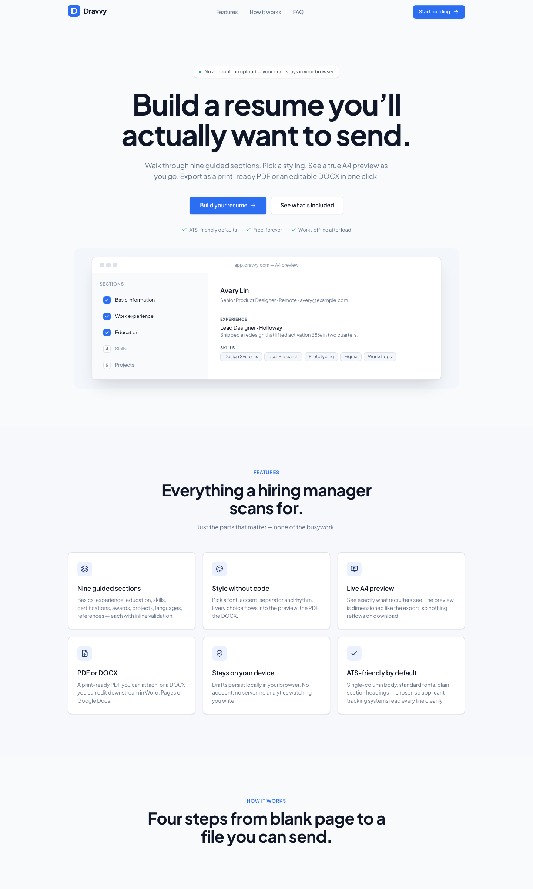
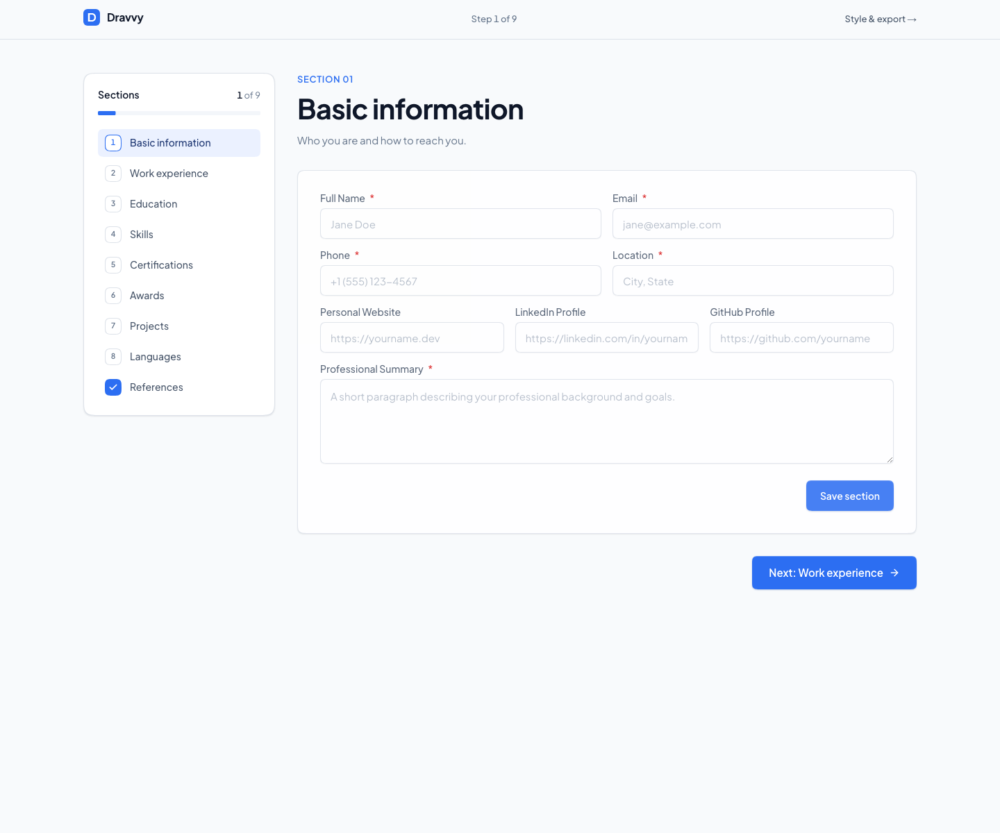
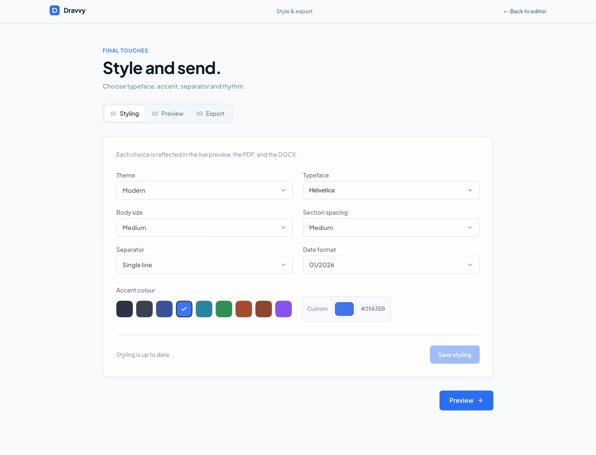
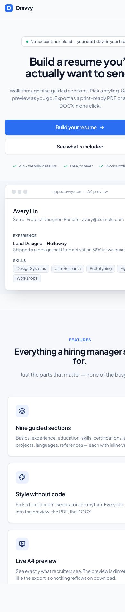
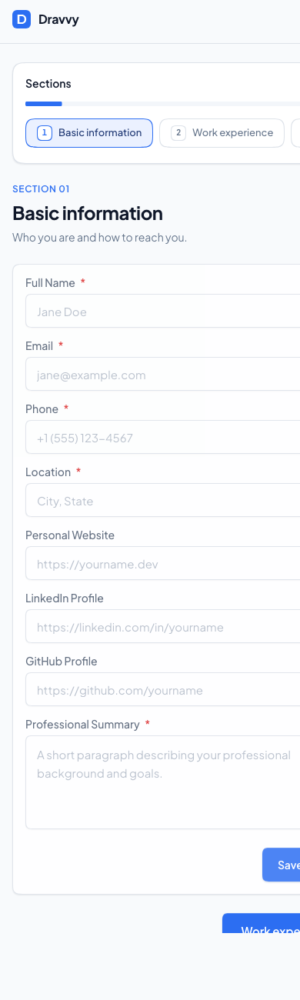
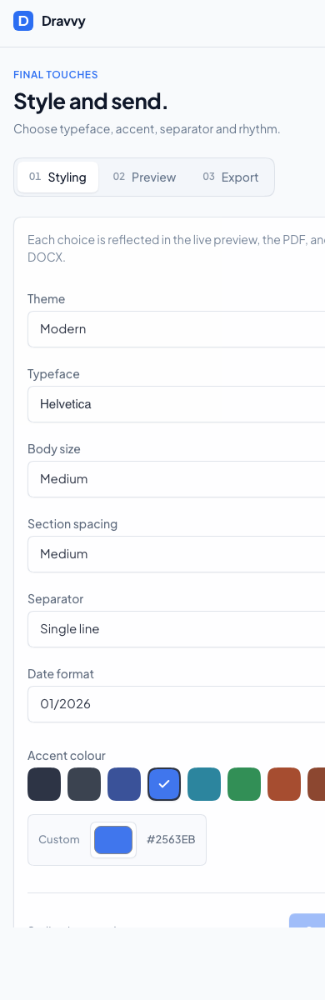
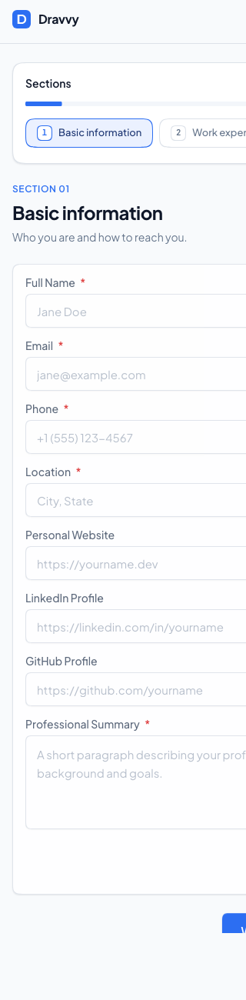

<div align="center">


# Dravvy

**Build a resume you'll actually want to send.**

A no-account, browser-only resume builder. Nine guided sections, a true A4
preview, and one-click export as a print-ready PDF or an editable DOCX.

[](https://github.com/nshizirunguwilson/Dravvy/actions/workflows/ci.yml)

[Features](#highlights) · [Screenshots](#screenshots) · [Styling](#styling-options) · [Devices](#devices-and-accessibility) · [Offline](#offline) · [Getting started](#getting-started) · [Testing](#testing) · [Stack](#stack)

</div>

---

## Highlights



- **No account, no upload.** Your draft lives in your browser. Clear site
  data and it's gone. Nothing to sign up for, nothing on a server.
- **Nine guided sections** with real inline validation: every field is bound to
  its own error message, announced to screen readers rather than flashed as a
  toast that names nothing.
- **Reorder, remove and undo.** Move any entry up or down, and a removal offers
  an undo that puts it back in its original position.
- **True A4 live preview** dimensioned to the millimetre, so what you see in
  the editor is what gets exported.
- **One-click export** as a print-ready A4 PDF *or* an editable DOCX that
  opens cleanly in Microsoft Word, Pages and Google Docs.
- **ATS-friendly defaults**: single-column body, standard fonts, plain
  section headings, chosen so applicant tracking systems read every line.
- **Stylable without code**: pick a typeface, accent, separator, body size,
  spacing rhythm and date format; the choice flows into the preview, the
  PDF and the DOCX.
- **Save and resume**: download a single progress file holding every section,
  your styling and the step you were on, then import it later, on any device,
  and carry on from exactly that point.
- **Light and dark theme**, remembered per device, following your operating
  system by default, and applied before first paint so there is no white
  flash. The resume page itself stays white paper in either theme.
- **Works offline.** A service worker caches the shell, so the whole builder
  keeps working with no connection, and installs to a phone home screen.
- **Verified on 14 device sizes**, from an iPhone 6s to a 16 inch MacBook Pro,
  in both themes, in Chromium and WebKit, with zero axe-core violations
  against WCAG 2.2 AA.

---

## Screenshots

### Editor: pick a section, fill the form, see your progress



A vertical sections rail on the left tracks completion in real time. Each
field has a visible boundary, a label above the input, and a clear required
marker. The footer always shows what comes next.

### Style & export: final touches before download



A pill-style segmented tab nav switches between **Styling**, **Preview**,
**Export** and **Save file**. The accent picker offers nine presets and a
custom hex; the selection is reflected in the preview, the PDF and the DOCX.
The Styling tab also carries the app theme control (light / dark / system).

### Mobile: built down to an iPhone 6s

<table>
  <tr>
    <td align="center" width="50%">
      
      <br /><sub><b>Landing</b> · 390px</sub>
    </td>
    <td align="center" width="50%">
      
      <br /><sub><b>Editor</b> · 390px</sub>
    </td>
  </tr>
  <tr>
    <td align="center" width="50%">
      
      <br /><sub><b>Settings</b> · 390px</sub>
    </td>
    <td align="center" width="50%">
      
      <br /><sub><b>Editor</b> · 320px</sub>
    </td>
  </tr>
</table>

The sections rail collapses to a horizontally-scrollable pill nav at < `lg`
(1024px) so the form gets the screen on small devices. CTAs stack
vertically and labels switch to compact variants on the smallest widths.

---

## Section coverage

| Section            | Required fields                                                          | Multiple entries |
| ------------------ | ------------------------------------------------------------------------ | ---------------- |
| Basic information  | Full name, email, phone, location, professional summary                  | No               |
| Work experience    | Job title, company, start date, end date or *current*, 2-4 bullet points | Yes              |
| Education          | Degree, field, institution, start date, end date / expected              | Yes              |
| Skills             | Category name + at least one skill                                       | Yes              |
| Certifications     | Title, issuer, issue date                                                | Yes              |
| Awards             | Title, issuer, date                                                      | Yes              |
| Projects           | Name, description (≥1 bullet), tech stack (≥1)                           | Yes              |
| Languages          | Language + proficiency (native / fluent / proficient / intermediate / …) | Yes              |
| References         | Either *available upon request* **or** named entries with full contacts  | Yes              |

Optional fields (LinkedIn, GitHub, personal site, GPA, certificate URL,
project link) appear in the preview/exports only when filled in.

---

## Save and resume

Drafts persist in `localStorage`, which is fine until you switch browser,
switch machine, or clear your site data. The **Save file** tab (and the
compact card in the editor rail) writes the whole draft to one portable
JSON file:

```jsonc
{
  "format": "dravvy.resume-progress",
  "version": 1,
  "savedAt": "2026-08-17T09:30:00.000Z",
  "progress": { "builderStep": 4, "settingsStep": 1 },
  "resume": { "contact": {}, "experience": [], "style": {} }
}
```

Importing reads that file back, restores every section and your styling, and
returns you to the step you were on. The reader is deliberately forgiving: a
half-finished draft imports fine, missing fields are filled with defaults,
and unknown styling values fall back rather than failing. Files that are not
valid JSON, were not written by Dravvy, or come from a newer format version
are rejected with a plain explanation, and your current draft is left
untouched until you confirm the replacement.

Nothing is uploaded. The file is produced and read entirely in the browser.

---

## Styling options

Nine groups, 42 individual choices:

| Group                     | Options | What it changes                                                             |
| ------------------------- | ------- | --------------------------------------------------------------------------- |
| Theme                     | 3       | Header alignment, name capitals, section heading ink and tracking, rule side |
| Typeface                  | 12      | The family used for the whole page                                           |
| Body size                 | 3       | Body, heading and section type together                                      |
| Section spacing           | 3       | Rhythm between header, rules and entries                                     |
| Separator                 | 4       | The rule drawn at each section boundary                                      |
| Date format               | 3       | How every start and end date is written                                      |
| Show profile links        | 2       | Whether LinkedIn, GitHub and your portfolio appear in the contact line       |
| Show language proficiency | 2       | Whether languages carry a level, so "English, native" or just "English"      |
| Accent colour             | 10      | Section heading ink and rule: nine presets plus any hex                      |

Every one of those is verified, not assumed. Two sweeps drive the real app and
the real exporters:

```bash
npm run proof:all          # all three sweeps, dev server managed for you
npm run proof:report       # build the visual proof sheet
```

`proof:styling` sets one option at a time, reloads, reads the rendered geometry
and computed styles back out of the browser, asserts the option took effect, and
captures a screenshot into [`docs/styling-proof/`](docs/styling-proof). It then
requires every specimen in a group to be pixel-distinct from its siblings, so an
option that silently does nothing cannot pass. It also counts the options in the
live form and fails if they no longer match the matrix, so a new option cannot
ship without proof.

`proof:exports` renders a real PDF and DOCX per option, unzips
`word/document.xml`, and asserts the marker the option should have written: the
font name, the half-point size, the accent hex, the border edge and style, the
spacing in twips, the formatted date.

**One documented constraint.** A PDF can only rely on the 14 fonts every reader
is required to have, so the twelve typefaces resolve to Times for the four serif
choices and Helvetica for the eight sans choices. The serif or sans decision is
preserved, the DOCX carries the exact typeface name, and the live preview renders
all twelve distinctly. This is asserted as the contract rather than hidden.

Google Sans is deliberately absent. It is Google's proprietary brand typeface,
is not published on Google Fonts, and cannot be licensed for use here. Outfit is
offered as the closest open geometric sans instead, under its own name.

---

## Devices and accessibility

The app is held to a ladder of 14 device sizes, from an iPhone 6s up to a 16
inch MacBook Pro, across all 9 screens, both themes, and both browser engines.
That is **504 combinations**, and every one is measured, not eyeballed:

```bash
npm run proof:responsive          # 504 combinations, 6 checks each
npm run proof:responsive:report   # build the visual proof sheet
```

Chromium stands in for Chrome and Edge, WebKit for Safari. WebKit is not
optional here: almost every device on the ladder runs Safari, and adding it
immediately found a horizontal scroll on phones that Chromium had absorbed
silently.

Each combination is loaded at the viewport a real browser actually gives the
page, which is not the same as the screen size. An iPhone 6s is a 375x667
device, but Safari hands the page 375x553 of it, and only 325px of height in
landscape. The ladder records both numbers and tests against the smaller one.

Six checks run every time:

1. The document never scrolls sideways.
2. No element extends past either edge, unless it sits inside a container that
   is meant to scroll. The A4 preview is the one such container.
3. Every control clears 44px on touch, and the WCAG 2.5.8 floor of 24px on a
   pointer. A checkbox is measured by its label, which is what you actually tap.
4. No two controls overlap.
5. No visible text renders below 12px.
6. [axe-core](https://github.com/dequelabs/axe-core) runs against `wcag2a`,
   `wcag2aa`, `wcag21a`, `wcag21aa` and `wcag22aa`, with zero serious or
   critical violations allowed.

Fitting on a screen is not the same as being usable on one, so
[`e2e/mobile-flow.spec.ts`](e2e/mobile-flow.spec.ts) drives a real iPhone 6s
viewport with touch enabled and builds a resume end to end: fills the basics,
saves, adds a role with bullet points, moves to styling, checks the preview,
and downloads the PDF.

### Where the evidence lives

Proof output is generated, not authored, so the pictures are not committed. The
scripts encode the checks, CI regenerates everything on every push and uploads
the screenshots as build artifacts, and only the measurements are versioned:

| Path | Committed | Why |
| ---- | --------- | --- |
| `scripts/*-proof.mjs`, `scripts/fixtures/*` | yes | The checks themselves |
| `docs/*/manifest.json`, `exports.json` | yes | Measurements, worth diffing over time |
| `docs/*/*.jpg`, `report.html` | no | Rebuilt by the sweep, uploaded by CI |

Rebuild the pictures and the proof sheets any time with the commands above.

---

## Offline

A service worker caches the app shell, and because the whole builder runs in the
browser there is nothing else to fetch: with the shell cached you can write,
style and export a resume with no connection at all.

- Navigations try the network first, so a deploy is picked up, and fall back to
  the cache when there is none.
- Static assets are content hashed, so they are served straight from the cache.
- A web manifest makes it installable: **Add to Home Screen** on a phone gives
  you a standalone app.

The worker is deliberately disabled in development, where it would only serve
stale code. To try it, run a production build:

```bash
npm run build && npm start
```

Then load the app, switch the Network tab to **Offline**, and reload.

---

## Theme

Light and dark, with a third **System** option that follows the operating
system live. The choice is stored per device under `dravvy-theme` and applied
by a small blocking script in `<head>`, so a dark-mode visitor never sees a
white flash on load. Switching also sets the native `color-scheme`, so
scrollbars, date pickers and other browser widgets follow along.

The A4 preview is the deliberate exception: it stays white paper with dark
ink in both themes, because that is exactly what the PDF and DOCX exports
produce. Printing from dark mode also falls back to the light palette.

---

## Stack

- **Next.js 14** (App Router) + **TypeScript** in strict mode
- **Tailwind CSS** with a hand-tuned token system in [`globals.css`](src/app/globals.css)
- **Plus Jakarta Sans** for the interface, plus twelve resume typefaces loaded
  on demand through `next/font` so you only download the one you pick
- **Radix UI** primitives (Select, Tabs, Switch, Progress, Radio)
- **Zustand** for the in-browser draft store, persisted to `localStorage`
- **Zod** for validation, wired directly to the field-level error messages
- **Framer Motion** for section transitions and micro-interactions
- **Sonner** for toasts, including the undo action on a deletion
- **`@react-pdf/renderer`** for PDF export, **`docx`** for DOCX export
- A **service worker** and web manifest, so the app runs offline and installs

Twenty runtime dependencies, and every one is imported somewhere. Anything that
stopped being used has been removed.

---

## Getting started

```bash
git clone https://github.com/nshizirunguwilson/dravvy.git
cd dravvy
npm install
npm run dev          # http://localhost:3000
```

### Scripts

| Script                | What it does                                                                  |
| --------------------- | ----------------------------------------------------------------------------- |
| `npm run dev`         | Next.js dev server with hot reload.                                           |
| `npm run build`       | Production build (also runs `next lint` and TypeScript checks).               |
| `npm run start`       | Serves the production build.                                                  |
| `npm run verify`      | Every automated check, in order. Manages its own dev server.                   |
| `npm run verify:quick`| Everything except the browser sweeps. About two minutes.                       |
| `npm run lint`        | Runs the Next/ESLint ruleset.                                                 |
| `npm run lint:dashes` | Fails if any em dash or en dash creeps into a tracked file.                    |
| `npm run typecheck`   | Strict TypeScript pass with no emit.                                          |
| `npm run test`        | Unit + component tests (Vitest, jsdom).                                       |
| `npm run test:coverage` | Unit/component tests with a v8 coverage gate.                               |
| `npm run test:e2e`    | End-to-end tests (Playwright, Chromium and WebKit) on a dev server at port 3100. |
| `npm run test:export` | Headless smoke test: renders the PDF and DOCX from a fixture and asserts the file headers. |
| `npm run proof:styling` | Sweeps every styling option through the live preview and captures evidence. |
| `npm run proof:exports` | Sweeps every styling option through a real PDF and DOCX.                      |
| `npm run proof:report` | Builds the styling proof sheet from the two sweeps.                           |
| `npm run proof:responsive` | Sweeps every screen across 14 devices, both themes, both engines.       |
| `npm run proof:responsive:report` | Builds the device proof sheet.                                    |
| `npm run proof:all`   | Runs all three sweeps against a dev server it starts and stops itself.        |
| `npm run format`      | Prettier formatting.                                                          |

The export smoke test is fully headless. It bundles the export modules
with esbuild, runs them in Node, and asserts that the PDF starts with
`%PDF` and the DOCX is a valid zip. CI can run it without a browser.

---

## Testing

Three layers, all runnable locally and in CI:

- **Unit & component**: [Vitest](https://vitest.dev) + React Testing Library
  (jsdom). Covers the utilities, the Zod schemas, both Zustand stores (every
  action), the UI primitives, every section of the resume form, the styling and
  export forms, the live preview, the DOCX export, the theme system, date
  formatting and the progress save/import format: **282 tests**. A v8 coverage
  gate enforces 90% statements / lines / functions and 85% branches across
  everything in `src/lib`, `src/hooks`, `src/store` and `src/components`
  (currently ~94% / ~92%).
- **End-to-end**: [Playwright](https://playwright.dev) (Chromium) drives the
  real app: the landing CTA into the builder, section-to-section navigation,
  the builder to style/export flow, the light/dark theme (including the
  no-flash reload), keyboard-only operation, and a full save-then-import round
  trip that wipes browser storage in between. It runs in **Chromium and
  WebKit**, because every phone and tablet in the device ladder runs Safari.
  Playwright starts its own dev server on port 3100, so it never collides with
  another server running on 3000.

- **Proof sweeps**: every styling option is driven through the live preview,
  a real PDF and a real DOCX; every screen is driven across 14 devices, both
  themes and both engines. These are described in full above.

```bash
npm run verify          # everything, in order, server managed for you
npm run verify:quick    # everything except the browser sweeps

npm run test            # unit + component (Vitest)
npm run test:coverage   # with coverage gate
npm run test:e2e        # end-to-end (Playwright, Chromium and WebKit)
npm run proof:all       # all three proof sweeps
```

> `npm run build` and `npm run dev` share the `.next` directory and corrupt
> each other if they run at the same time. `npm run verify` sequences them
> correctly, so prefer it over running the pieces in parallel yourself.

**[TESTING.md](TESTING.md)** walks through checking every feature by hand,
including offline, dark mode, keyboard-only and screen reader behaviour.

**[TESTING.md](TESTING.md) is the full guide**: what every command proves, how
to walk each feature by hand, how to check offline, dark mode, keyboard only and
screen reader behaviour, and what to do when something fails.

Every push and pull request runs lint, the dash check, typecheck, the unit
suite with coverage, the production build, the Playwright e2e suite, both
styling proof sweeps, and a Docker image build via
[GitHub Actions](.github/workflows/ci.yml).

---

## Docker

A multi-stage `Dockerfile` builds the app and serves it from a slim runtime
image as an unprivileged user:

```bash
docker build -t dravvy .
docker run -p 3000:3000 dravvy        # http://localhost:3000
# …or with compose
docker compose up --build
```

The runtime image carries only production dependencies and the build output,
no test tooling, source maps or dev dependencies.

---

## Project structure

```
src/
├── app/
│   ├── layout.tsx            Root layout, fonts, sonner toaster, error boundary
│   ├── page.tsx              Landing page
│   ├── create/page.tsx       Multi-step builder
│   ├── settings/page.tsx     Style + preview + export
│   ├── icon.tsx              Generated 64px favicon
│   ├── opengraph-image.tsx   Generated 1200×630 OG image
│   ├── not-found.tsx         404 page
│   └── globals.css           Design tokens + base styles
│
├── components/
│   ├── brand.tsx             Mark + Wordmark
│   ├── error-boundary.tsx
│   ├── export-form.tsx       PDF/DOCX export controls
│   ├── progress-tracker.tsx  Sections rail (vertical on lg+, pill scroll on <lg)
│   ├── resume-form.tsx       The nine guided sections
│   ├── resume-pdf.tsx        @react-pdf/renderer document
│   ├── resume-preview.tsx    Live A4 preview
│   ├── styling-form.tsx      Theme, typeface, accent, etc.
│   └── ui/                   Branded primitives (button, input, select, …)
│
├── hooks/                    Small client hooks (useHydration, …)
├── lib/                      Utilities (cn, resume-docx builder, …)
├── store/                    Zustand stores (resume + UI state)
└── types/                    Shared types (ResumeStyle, Experience, …)
```

---

## Design notes

- **One sans family**: Plus Jakarta Sans, no serif, no mono spec labels.
  Typography hierarchy is carried by weight (400 / 500 / 600 / 700) and
  scale, not by mixing families.
- **Cool slate canvas + white surfaces.** A single restrained blue accent
  (`hsl(220 88% 56%)`) on the primary CTA, focus rings and links, never
  on every interactive element.
- **Bordered fields with labels above.** Inputs are 44px tall, white, with
  a 1px slate border at rest and a brand-coloured focus ring. Labels sit
  above the field at 14px / weight 500, in normal sentence case.
- **Three radii**: `8px` (sm), `12px` (default), `18px` (lg), used for
  different surface roles, not the same radius for everything.
- **Layered shadows**: five shadows from `xs` to `pop`, each composed of
  a tight ambient shadow plus a soft cast, so cards lift without halos.
- **Reduced motion respected** throughout (transitions and animations
  collapse to ≈0ms when the user prefers reduced motion).
- **Dark-mode tokens defined** in `globals.css` for a future toggle.

---

## Privacy

- No accounts.
- No upload.
- No analytics, no telemetry, no third-party trackers.
- The draft is persisted in your browser via `localStorage` (Zustand
  `persist` middleware). Clear site data and the draft is gone with it.

---

## License

This project is open source. See the repository for license details.
